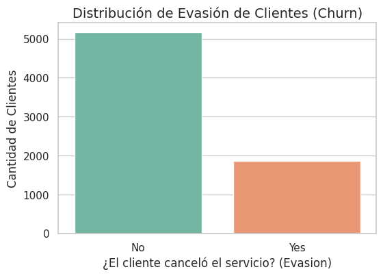
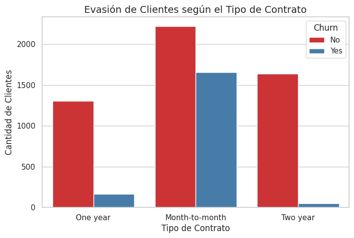
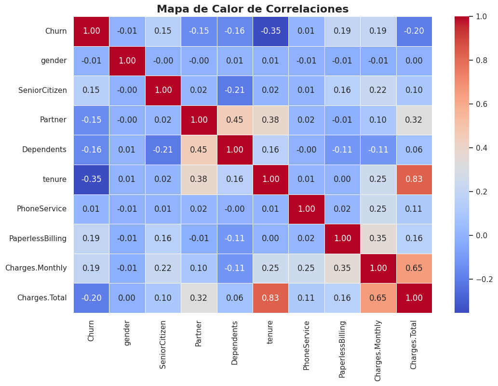
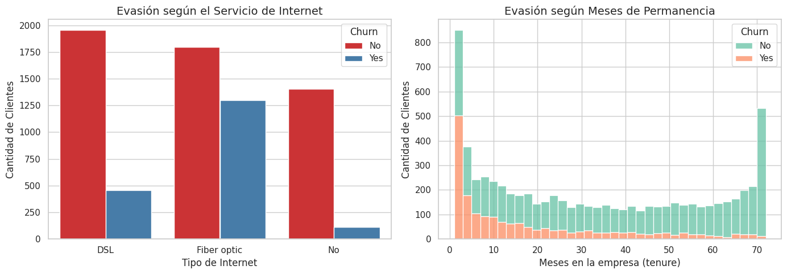

  <h1>Análisis de Retención de Clientes (Churn) - Telecom X</h1>
  <h3>Proyecto de Análisis de Datos en Python</h3>
  
  
  
  
  

---

## Contexto del Proyecto

Para cualquier empresa de servicios, conseguir un cliente nuevo siempre es mucho más caro que mantener a uno que ya existe. En este proyecto analizo la base de datos de Telecom X, una empresa de telecomunicaciones que se enfrenta a un problema grave: una gran cantidad de sus clientes están cancelando sus servicios (lo que en la industria se conoce como *Churn*). 

Mi objetivo con este análisis es dejar de lado las suposiciones y usar los datos para responder preguntas clave: **¿Quiénes son los clientes que se van? ¿Por qué se están yendo? y, lo más importante, ¿qué podemos hacer para evitarlo?**

---

## ¿Cómo trabajé con los datos?

Para llegar a conclusiones reales, primero tuve que asegurar que la información fuera confiable. Realicé un proceso completo de limpieza y preparación utilizando Python y la librería Pandas:

1. **Extracción y Limpieza:** Obtuve los datos desde una API en formato JSON. Me encontré con mucha información agrupada (diccionarios dentro de columnas) que tuve que separar para poder leerla bien. Además, descubrí y reparé errores ocultos, como "espacios en blanco" en la columna de cobros que la base de datos no registraba como nulos, pero que impedían hacer sumas y cálculos.
2. **Transformación para el análisis:** Las computadoras no pueden hacer cálculos matemáticos con palabras como "Yes" o "No". Por eso, transformé todas las respuestas de texto en números (1 y 0). Este paso fue fundamental para poder cruzar la información más adelante y descubrir qué factores están matemáticamente conectados con la pérdida de clientes.

---

## Lo que nos contaron los datos (Hallazgos)

Después de limpiar la información, comencé a cruzar las variables. Aquí presento los descubrimientos más importantes de mi análisis.

### 1. El tamaño real del problema
Lo primero fue entender qué tan grave era la situación. Descubrí que casi el 26% de los clientes en la base de datos ya habían cancelado su servicio. Pero el dato que realmente enciende las alarmas es el impacto económico: **esta fuga de clientes representa una pérdida de $139,130 dólares al mes**, es decir, el 30.5% del dinero que la empresa podría estar ganando.

  
   
  <i>Figura 1: Comparativa entre clientes que se quedan y clientes que cancelaron su servicio.</i>

### 2. El peligro de no tener compromisos a largo plazo
Quise averiguar si el tipo de contrato tenía algo que ver en la decisión de irse. La diferencia resultó ser abismal. Los clientes que tienen planes de renovación mensual ("Month-to-month") son los que más cancelan. Al no tener una atadura o penalización por irse, abandonan el servicio rápidamente. En cambio, quienes firman contratos por uno o dos años demuestran una lealtad altísima.

  
   
  <i>Figura 2: La inmensa mayoría de las cancelaciones ocurre en los contratos de mes a mes.</i>

### 3. Buscando a los verdaderos culpables (Mapa de Calor)
Para no tener que mirar las columnas una por una, creé un "Mapa de Calor de Correlaciones". Este gráfico cruza todas las variables numéricas y nos muestra con colores qué cosas están más conectadas entre sí. 
Descubrí que la variable que más nos protege de perder clientes es el tiempo que llevan en la empresa (la casilla azul oscura de *tenure*). Por otro lado, los cobros mensuales muy altos (*Charges.Monthly*) empujan a los clientes a irse (color rojo).

  
   
  <i>Figura 3: Mientras más azul es la casilla, más ayuda a retener al cliente. Mientras más roja, más lo empuja a irse.</i>

### 4. El momento crítico y el falso problema de la Fibra Óptica
Finalmente, quise ver exactamente en qué mes se nos van los clientes y si el tipo de internet influía en su molestia. Aquí encontré los dos datos más valiosos de todo el proyecto:

* **La zona de peligro:** El gráfico de la derecha muestra una "montaña" enorme al principio. Esto significa que si un cliente va a cancelar, es casi seguro que lo hará entre su primer y su quinto mes de servicio. Si logramos que pasen del medio año, es muy probable que se queden por años.
* **El secreto de la Fibra Óptica:** A simple vista (gráfico de la izquierda), parece que la fibra óptica es un mal servicio porque muchos la cancelan. Pero al investigar más a fondo calculando porcentajes en el código, me di cuenta de que el problema no es el internet, es que la gente se frustra al usarlo. **Casi la mitad (49.4%) de los que tienen fibra óptica pero NO contrataron soporte técnico terminan yéndose**. Cuando sí cuentan con soporte, la evasión cae a la mitad (22.6%).

  
   
  <i>Figura 4: A la izquierda, evasión por tipo de internet. A la derecha, en qué mes exacto se van los clientes.</i>

### Otros datos interesantes que encontré en el análisis
* **El "Ancla" Familiar:** Las familias (clientes que indicaron tener pareja e hijos) cancelan muchísimo menos (14.3%) que las personas solteras (34.2%). Mudar el internet de una casa llena de dispositivos conectados da mucha pereza, lo que nos juega a favor.
* **El estrés de pagar a mano:** El 45.3% de los clientes que pagan manualmente cada mes (con cheque electrónico) terminan yéndose. En cambio, los que tienen su tarjeta afiliada al pago automático ni se enteran de que están pagando y su tasa de fuga es de apenas el 15%.

---

## Mis recomendaciones para la empresa

Con todos estos datos sobre la mesa, mis sugerencias para que Telecom X recupere esos casi $140,000 dólares mensuales son directas:

1. **Cuidar mucho los primeros 5 meses:** El equipo de atención al cliente debe enfocarse en hacer un acompañamiento intensivo (llamadas, encuestas rápidas) asegurándose de que todo funcione perfecto durante los primeros meses del cliente. Es la zona de mayor riesgo.
2. **Regalar soporte técnico al principio:** Si un cliente contrata Fibra Óptica, la empresa debería incluirle el Soporte Técnico gratis por lo menos los primeros tres meses. Si evitamos que se frustren configurando sus equipos, no cancelarán el servicio.
3. **Ofrecer descuentos por pasarse a débito automático:** Pagar manualmente hace que el cliente se cuestione el gasto cada mes. Hay que hacer campañas promocionales para que afilien su tarjeta de crédito.
4. **Fomentar los planes anuales y familiares:** Ofrecer beneficios extra (como más velocidad de internet) si la persona firma un contrato de un año o si inscribe a toda su familia en una misma cuenta, ya que los datos demuestran que estos son los clientes más estables y leales.

---

  <i>Análisis y desarrollo por <b>Juan Ignacio Aranda</b></i>

