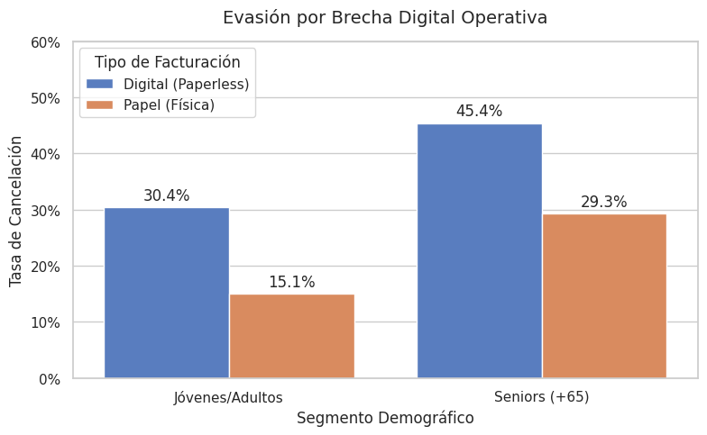
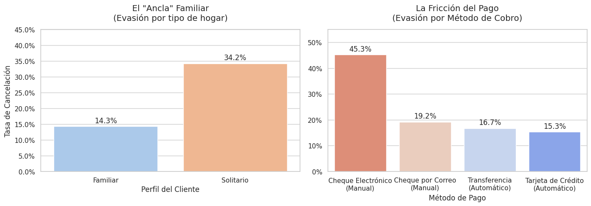

# Análisis de Abandono de Clientes - Telecom X

Este repositorio contiene un análisis de datos enfocado en entender la pérdida de usuarios (Churn) de la empresa Telecom X. El trabajo abarca desde la limpieza de la base de datos original hasta la identificación de patrones de comportamiento que afectan la rentabilidad mensual.

  
  
  
  

### El problema de negocio
Retener a un cliente es considerablemente más barato que adquirir uno nuevo. En este proyecto, analicé la base de clientes para identificar por qué un porcentaje crítico está cancelando el servicio y cómo esto impacta en el flujo de caja de la compañía.

### Limpieza y preparación de la información
Los datos provienen de una API en formato JSON con estructuras anidadas. Para poder trabajar con ellos, realicé un proceso de aplanamiento de columnas y limpieza profunda:
* Corregí errores de formato en la facturación total, donde existían espacios en blanco que impedían realizar cálculos numéricos.
* Traduje las variables clave al español y generé nuevas métricas, como el gasto diario por usuario.
* Transformé datos de texto a valores binarios (0 y 1) para ejecutar el análisis de correlación.

---

### Diagnóstico de los datos (Hallazgos principales)

1. **La fuga de ingresos**
Casi el 26% de los clientes han cancelado su servicio. Calculé que esto representa una pérdida de **$139,130 USD mensuales**, lo que compromete el 30% del potencial de facturación de la compañía.

  

2. **La fragilidad del contrato mes a mes**
Existe una brecha enorme según el tipo de contrato. Los clientes con planes mensuales se van constantemente al no tener barreras de salida. En cambio, los contratos a largo plazo (1 o 2 años) actúan como el mejor retenedor natural.

3. **La brecha operativa en adultos mayores**
Uno de los hallazgos más relevantes fue que la tasa de abandono en personas mayores de 65 años se dispara al 45% cuando utilizan factura digital. Esto sugiere que la digitalización forzada en este segmento está provocando desconexiones, posiblemente por falta de seguimiento o dificultades de acceso.

  

4. **Fricción en los pagos y entorno familiar**
El método de pago manual (cheques electrónicos) muestra una fuga altísima del 45%. Si el cliente debe realizar el trámite de pago manualmente cada mes, es más propenso a cuestionar el gasto y cancelar. Por otro lado, vivir en familia (con pareja e hijos) reduce la fuga a solo un 14%.

  

5. **El mito de la fibra óptica**
Aunque la fibra óptica parece tener una alta tasa de cancelación, los datos muestran que el culpable no es la tecnología, sino la falta de soporte. Los usuarios de fibra sin soporte técnico contratado abandonan el servicio el doble de rápido que aquellos que sí cuentan con él.

---

### Lo que sugiero a la empresa
Tras analizar estos puntos, mis recomendaciones para frenar la fuga son:
* **Automatización de cobros**: Lanzar campañas para migrar a los clientes de pago manual a débito automático. Reducir la fricción en el pago aumenta la retención.
* **Atención a la tercera edad**: Restablecer la factura en papel para clientes mayores de 65 años o simplificar su proceso de pago para reducir ese 45% de abandono.
* **Soporte técnico preventivo**: Incluir soporte técnico gratuito durante los primeros meses en las altas de fibra óptica para asegurar una experiencia inicial positiva.

---

  Análisis desarrollado por **Juan Ignacio Aranda**

